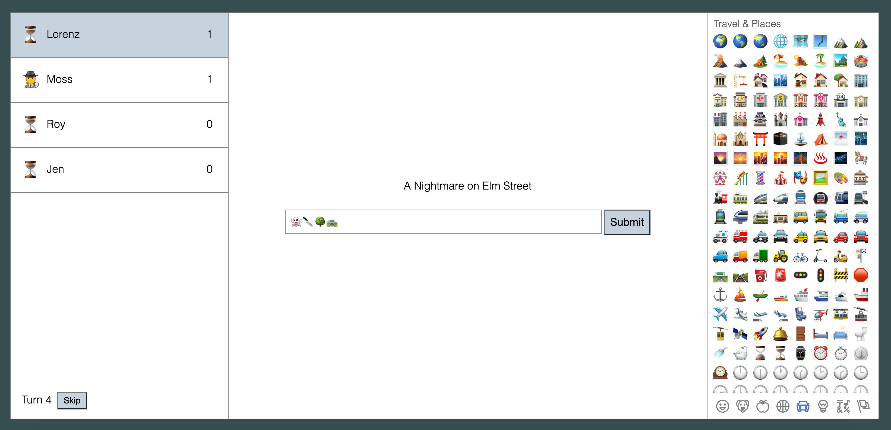

# Emojigame

This is a simple multiplayer game where you have to express a concept using only Emojis and your friends have to guess.

I created this during the initial lockdown in spring of 2020 with the idea of having something to play with friends during online reunions.

I tried several lists of guessing words or phrases. The most fun turned out to be movie titles. Maybe song or book titles could work too.

The game is written in ELM on the frontend and in Typescript on the Backend. It is not finished in any way.
There are still some bugs and parts of the code are a mess, but I was able to enjoy several games with friends.

## How to run it

I don't have a server set up, so if you want to play, you have to run the server yourself.

1. Clone the repository.
2. Install npm and elm if you don't have them installed.
3. Run `npm start` in your terminal.
4. You can now access the game through `localhost:8999`.
5. Use for example "ngrok" to make the game accessible through the internet.

### Credits

The emoji picker was adapted from https://github.com/Holmusk/elmoji/tree/1.0.4
